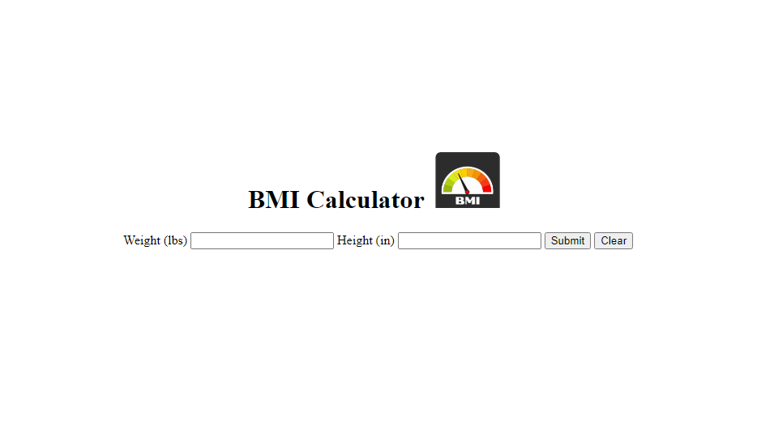

# BMI Calculator

## About The Project
This application takes a users height(inches) and weight(lbs) to calculate the users body mass index, which is compared to a BMI chart and gives examples of other known people with similar bmi


## Getting Started

### Prerequisites

* npm
  ```sh
  npm install npm@latest -g
  ```

### Installation

1. Clone the repo
   ```sh
   git clone https://github.com/Ja-Bril/BmiCalc.git
   ```


## Contact

Diego Abril -  - abrildiego96@gmail.com
Project Link: [https://github.com/Ja-Bril/BmiCalc](https://github.com/Ja-Bril/BmiCalc)


[React.js]: https://img.shields.io/badge/React-20232A?style=for-the-badge&logo=react&logoColor=61DAFB
[React-url]: https://reactjs.org/
Project Link: [https://github.com/Ja-Bril/BmiCalc]

